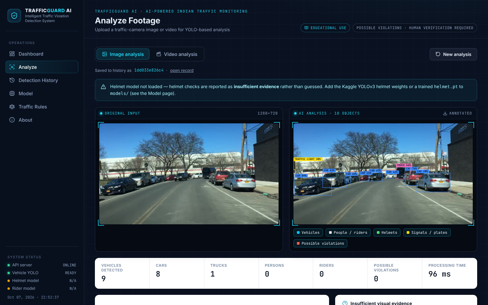

# TRAFFICGUARD AI
### YOLO-Based Indian Traffic Violation Detection & Analysis System

*Intelligent Traffic Violation Detection System — AI-Powered Indian Traffic Monitoring*

TrafficGuard AI analyses traffic-camera **images and videos** with YOLO object detection, reasons about
the relationships between vehicles, riders and helmets, and reports **AI-detected possible violations**
of Indian traffic rules — each with a confidence score, an evidence image, a plain-language explanation
and a configurable legal reference. Every result is labelled *"Requires human verification"*.

> Educational project. It is not an enforcement tool and its output is not legal proof.



---

## What it does

| Capability | Image | Video | How |
|---|:-:|:-:|---|
| Vehicle detection & counting (motorcycle, car, bus, truck, bicycle) | ✅ | ✅ unique via tracking | COCO-pretrained YOLO11 |
| Rider ↔ two-wheeler association | ✅ | ✅ | Geometric relationship analysis |
| **Rider / pillion without helmet** (MV Act s.129) | ✅ | ✅ temporally validated | Helmet model + head-region search |
| **More than two persons on a two-wheeler** (MV Act s.128) | ✅ | ✅ | Strong-association rider count |
| **Crossing stop line on red** (MV Act s.119) | ❌ by design | ✅ experimental | Stop line + signal colour + ByteTrack |
| Object tracking | — | ✅ | ByteTrack (or BoT-SORT) |
| Number-plate reading | optional | optional | Only if you add a plate model + easyocr |
| Seat belt · phone use · lane discipline | ❌ | ❌ | Listed as *not implemented* — not reliably inferable |

False-positive controls: per-class confidence thresholds, duplicate filtering, spatial validation,
size/truncation checks, a strong-association rule for multiple riding, temporal validation across
frames, and an explicit **"insufficient visual evidence"** state instead of guessing.

## Reference dataset — what it actually contains

The Kaggle notebook [Motorbike and Helmet YOLO Detection](https://www.kaggle.com/code/stpeteishii/motorbike-and-helmet-yolo-detection)
runs two **pretrained Darknet YOLOv3** models (OpenCV DNN) from two datasets:

* `savanagrawal/detect-person-on-motorbike-or-scooter` — YOLO-format images + labels, **1 class** (person on a two-wheeler), with flipped copies, plus YOLOv3 weights.
* `savanagrawal/helmet-detection-yolov3` — YOLOv3 weights for **1 class `Helmet`**, *no images*.

So the project does **not** invent "no-helmet", plate or vehicle classes for that data: vehicles come
from COCO, helmets from the reference helmet model (or one you train), and the rider dataset trains an
optional YOLO11 rider detector. Details: [datasets/README.md](datasets/README.md).

## Quick start

Requirements: Python 3.10+, ~3 GB disk for PyTorch. Node.js is **not** needed to run (the built dashboard is committed).

```bash
git clone https://github.com/muhammedaabirturab/traffic-camera-detection.git
cd traffic-camera-detection
python -m venv .venv
source .venv/bin/activate            # Windows: .venv\Scripts\activate
pip install -r requirements.txt
python run.py
```

Open **http://127.0.0.1:8000**. The COCO YOLO11 weights (~6 MB) download automatically on first start.

### Enable helmet checks (recommended before a demo)

Without a helmet model, riders are detected but helmet checks show *insufficient evidence*. Easiest fix — no training:

1. Download Kaggle dataset [`savanagrawal/helmet-detection-yolov3`](https://www.kaggle.com/datasets/savanagrawal/helmet-detection-yolov3).
2. Copy `yolov3-helmet.cfg`, `yolov3-helmet.weights`, `helmet.names` into `models/`.
3. Click **Model → Reload models** (or restart).

See [models/README.md](models/README.md) for all model options.

### Train the rider model

```bash
python scripts/prepare_dataset.py --source ~/Downloads/detect-person-on-motorbike-or-scooter --out datasets/rider --names rider
python scripts/train.py --data datasets/rider/data.yaml --role rider --epochs 60      # add --device 0 on a GPU
```

Weights are installed to `models/rider.pt` and precision / recall / F1 / mAP@50 / mAP@50-95 plus plots
are written to `models/metrics/`, which the **Model** page displays. No GPU? Run
[`notebooks/training/trafficguard_training.ipynb`](notebooks/training/trafficguard_training.ipynb) on Kaggle (free GPU, datasets attach directly) and download the results.

### Command line

```bash
python scripts/predict.py path/to/image.jpg
python scripts/predict.py path/to/clip.mp4 --stop-line 0.62 --direction down
```

### Development

```bash
python run.py --reload                 # API on :8000
cd frontend && npm install && npm run dev   # dashboard on :5173 (proxies to :8000)
npm run build                          # rebuild frontend/dist after UI changes
pytest                                 # 50 tests, run offline (models are faked in API tests)
```

## How it works

```
Input → Preprocessing → YOLO detection → Object identification → Tracking (video)
      → Relationship analysis → Rule engine → Violation classification
      → Confidence evaluation → Evidence generation → Dashboard
```

**Helmet logic:** detect motorcycle → detect persons → score each person as "seated on this bike"
(horizontal alignment, vertical layout, overlap, scale) → take the top 30 % of each rider box as the
head region → look for a helmet box centred there → no helmet ⇒ *possible* violation; rider too small,
cut off, or no helmet model ⇒ *insufficient evidence*. Full details, formulas and thresholds:
[docs/methodology.md](docs/methodology.md).

**Confidence bands** (configurable): high ≥ 0.85 · medium ≥ 0.65 · low ≥ 0.45 · below → not reported.

**Legal references** live in [`app/rules/traffic_rules.json`](app/rules/traffic_rules.json), which you can
edit without touching code (changes are picked up automatically). Sections were checked against
bare-act text; anything not verified is left blank rather than guessed. Fines are not presented as
definitive — penalty notes point to the current official notification.

## Project structure

```
app/
  main.py                 FastAPI app (API + serves the dashboard)
  config.py               all thresholds/paths (TG_* env overrides)
  detection/              yolo_detector · preprocessing · association · violation_detector · tracker · signal
  rules/                  traffic_rules.json · rule_engine.py
  analysis/               image_analyzer · video_analyzer · evidence_generator · plate_reader · jobs
  storage/history.py      SQLite history
  utils/                  visualization · logging · helpers
frontend/                 React + Vite dashboard (src/, built dist/)
scripts/                  prepare_dataset · train · validate · predict · export_model
notebooks/training/       Kaggle/Colab training notebook
models/                   weights (git-ignored) + metrics/
datasets/                 datasets (git-ignored)
docs/                     architecture · methodology · model
tests/                    detection · rules · API tests
```

## Suggested demo flow (viva)

1. **Dashboard** — explain the pipeline and detector status.
2. **Analyze → Image** — upload a two-wheeler photo; toggle overlay layers; open the violation card
   (confidence band, evidence crop, explanation, legal reference, "Requires human verification").
3. Point out **Insufficient visual evidence** and the **Two-wheeler relationship analysis** panel.
4. **Analyze → Video** — enable the red-light module, place the stop line, show tracking IDs, the timeline and evidence frames.
5. **Traffic Rules** — editable database, verified vs unverified references, not-implemented rules.
6. **Model** — measured metrics after training (or the honest "not trained" state).

## Limitations

Results depend on the installed models and footage quality (occlusion, night, low resolution, camera
angle). COCO models were not trained on Indian traffic specifically. Legal exemptions cannot be judged.
See [docs/methodology.md](docs/methodology.md#9-limitations).

## Licences

Project code: MIT (see [LICENSE](LICENSE)). Ultralytics YOLO is licensed under **AGPL-3.0**; if you
distribute this project or offer it as a service, review Ultralytics' licence terms. The Kaggle datasets
and weights belong to their original authors and are not redistributed here.
