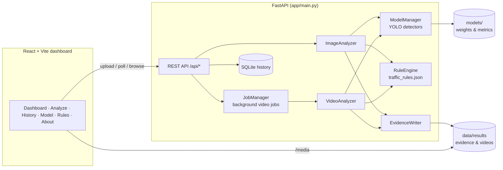

# Architecture

TrafficGuard AI is a local client–server application: a FastAPI backend that runs the YOLO pipeline and a
React dashboard that the same server hosts.



## Backend modules

| Path | Responsibility |
|---|---|
| `app/config.py` | Every threshold and path, overridable with `TG_*` environment variables |
| `app/detection/yolo_detector.py` | `UltralyticsDetector` (YOLO11/v8 `.pt`), `DarknetDetector` (YOLOv3 cfg+weights via OpenCV DNN), `ModelManager`, duplicate filtering |
| `app/detection/preprocessing.py` | Decode/validate input, downscale large frames, CLAHE low-light enhancement |
| `app/detection/association.py` | **Relationship analysis**: rider ↔ motorcycle association score, head region, helmet matching |
| `app/detection/violation_detector.py` | Converts a frame's relationships into violation *candidates* and *observations* |
| `app/detection/tracker.py` | Temporal validation across tracked frames; red-light stop-line crossing |
| `app/detection/signal.py` | Traffic-light colour estimation (HSV) and smoothing |
| `app/rules/traffic_rules.json` | Editable rule database: names, logic, legal references, penalty notes, status |
| `app/rules/rule_engine.py` | Thresholds, confidence bands, wording, legal context, explanations |
| `app/analysis/image_analyzer.py` | Image pipeline + stage timings |
| `app/analysis/video_analyzer.py` | Frame sampling, ByteTrack tracking, temporal validation, H.264 output |
| `app/analysis/evidence_generator.py` | Annotated frames, close-up crops, thumbnails |
| `app/analysis/plate_reader.py` | Optional plate OCR (needs a plate model + easyocr) |
| `app/analysis/jobs.py` | Background worker for long video analyses |
| `app/storage/history.py` | SQLite history (summary columns + full JSON result) |
| `app/model_info.py` | Model page data built from files on disk |

## API

| Method | Endpoint | Purpose |
|---|---|---|
| GET | `/api/health` | Server and detector status |
| POST | `/api/analyze/image` | Multipart `file` (JPG/JPEG/PNG) → full result JSON |
| POST | `/api/analyze/video` | Multipart `file` (MP4/AVI/MOV), optional `stop_line` (0.05–0.95), `line_direction`; returns `202 {job_id, analysis_id}` (or the full result with `?wait=true`) |
| GET | `/api/jobs/{job_id}` | Video job progress |
| GET | `/api/rules` | Rule database |
| GET | `/api/model/info` | Detectors, classes, measured metrics |
| POST | `/api/model/reload` | Re-scan `models/` |
| GET | `/api/history` | Analyses (filter `kind=image|video`) |
| GET / DELETE | `/api/history/{id}` | Reopen / delete one analysis |
| GET | `/api/stats` | Dashboard aggregates |
| GET | `/api/settings` | Active thresholds |

Interactive documentation: `http://127.0.0.1:8000/docs`.

### Image result (abridged)

```json
{
  "status": "success",
  "analysis_id": "5110570ce5bd",
  "summary": {"vehicles": 3, "by_class": {"car": 1, "motorcycle": 2, "person": 3}, "riders": 3,
              "possible_violations": 1},
  "detections": [{"id": 0, "label": "motorcycle", "confidence": 0.91, "bbox": [x1, y1, x2, y2], "source": "vehicle"}],
  "two_wheelers": [{"vehicle_id": 0, "riders": [{"person_id": 2, "association": 0.94, "helmet_status": "no_helmet"}]}],
  "violations": [{
    "rule_id": "NO_HELMET", "title": "Possible No-Helmet Violation", "confidence": 0.78, "confidence_band": "medium",
    "label": "AI-detected possible violation", "status": "Requires human verification",
    "vehicle": {"type": "motorcycle", "confidence": 0.91}, "evidence": "Helmet not detected in rider's head region",
    "explanation": "…", "legal_reference": {"act": "Motor Vehicles Act, 1988", "section": "Section 129"},
    "evidence_images": {"crop": "/media/…/violation_01_crop.jpg", "frame": "/media/…/violation_01_frame.jpg"}
  }],
  "observations": [{"rule_id": "NO_HELMET", "message": "Helmet check not possible: Rider too small to judge (31 px tall)"}],
  "confidence": 0.78,
  "pipeline": [{"stage": "YOLO detection", "detail": "7 objects …", "ms": 112.4}],
  "processing_time": 0.41
}
```

## Frontend

`frontend/src/` — `pages/` (one per navigation item), `components/` (`ImageResult`, `VideoResult`,
`DetectionOverlay` (SVG boxes over the image, layer toggles), `ViolationCard`, `ResultParts`, `ui`),
`lib/` (API client, formatting, status polling). In development Vite proxies `/api` and `/media` to
port 8000; for demos the built `frontend/dist` is served by FastAPI itself.

## Storage

* `data/history.sqlite3` — one row per analysis.
* `data/results/<id>/` — `original.jpg`, `annotated.jpg`, `thumb.jpg`, `violation_NN_{frame,crop}.jpg`, `processed.mp4`.
* `data/uploads/` — uploaded videos.

All of `data/` is git-ignored and can be deleted to reset the demo.
