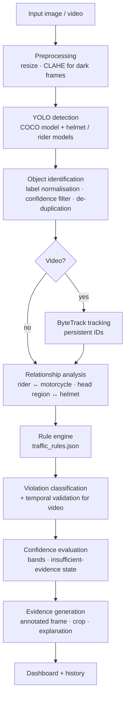

# Methodology

The system separates three concerns that are often blurred together:

1. **Object detection** — *what is in the frame?* (YOLO)
2. **Traffic-rule inference** — *how are the objects related?* (geometric relationship analysis, tracking)
3. **Violation classification** — *does that relationship match a rule, and how sure are we?* (rule engine)



## 1. Detection

* **COCO YOLO11n** detects `person`, `bicycle`, `car`, `motorcycle`, `bus`, `truck`, `traffic light`
  (scooters are detected as `motorcycle` in COCO).
* **Helmet model** — either the reference YOLOv3 `Helmet` model (Darknet via OpenCV DNN) or a YOLO11
  model trained with `scripts/train.py --role helmet`, which may also provide a bare-head class.
* **Rider model** (optional) — YOLO11 trained on the Kaggle person-on-two-wheeler data.

Class names from every model are normalised to canonical labels (`app/detection/types.py`) so that
e.g. `Motorbike`, `With Helmet` and `Without Helmet` all work. Detections below per-class minimum
confidences are discarded, and boxes of the same object reported twice (e.g. as both `motorcycle` and
`bicycle`, IoU > 0.7) are merged, keeping the most confident one.

## 2. Rider ↔ motorcycle association

A person is a *rider* of a motorcycle only if their boxes form the layout of someone sitting on it.
Four cues are scored in [0, 1] (`rider_association_score`):

| Cue | Rationale |
|---|---|
| Horizontal alignment — share of the person's width over the (10 %-widened) bike, with the person's centre inside it | A rider sits *over* the bike; a bystander is beside it |
| Vertical layout — person's bottom edge between 25 % down the bike box and 10 % below it, and head above the upper third of the bike | A seated person's legs end inside the bike box; a standing pedestrian's feet are at or below the wheels |
| Overlap — ≥ 30 % of the person box overlapping the bike box gives full credit | Removes people merely aligned with a bike in the distance |
| Scale — person height 0.6–3.2 × bike height | Rejects tiny far-away people lined up behind a nearby bike |

`score = horizontal^0.7 × vertical × (0.4 + 0.6 × overlap) × scale`

Each person is assigned to at most one motorcycle (the highest score) and counts as a rider if the score
is ≥ `rider_association_min` (0.50). A box from the rider model containing the person adds +0.15.

## 3. Helmet rule (MV Act s.129)

For every rider:

1. Head region = top 30 % of the person box (widened by 10 % each side, raised by 10 % of its height).
2. A helmet box matches if its centre lies in the head region **and** ≥ 30 % of its area is inside it.
   (A helmet hanging on the handlebar or carried in the hand does not count.)
3. Outcome:
   * helmet matched → compliant;
   * bare-head box matched (if the model has that class) → no helmet, strong evidence;
   * nothing matched → no helmet, absence evidence;
   * **insufficient evidence** when no helmet model is loaded, the rider is < 48 px tall, or the head is cut off by the frame edge.

Confidence of a no-helmet candidate:

```
evidence   = bare-head confidence            (if detected)
           = 1 − max helmet confidence near the head   (otherwise)
confidence = evidence × √person_conf × √association × bike_conf^0.25 × (0.7 + 0.3 × size_factor)
```

A weak helmet detection close to the head therefore *lowers* the confidence of an absence call instead
of being ignored.

## 4. Multiple riding (MV Act s.128(1))

The law allows the driver plus one pillion. A candidate is created only when **more than two** people
are associated with the same motorcycle *with a strong score* (≥ 0.62). If three people are near a bike
but only two are clearly seated, the result is *insufficient visual evidence*, not a violation.

## 5. Red-light module (video only, experimental)

A single image cannot show that a vehicle crossed a stop line while the light was red, so the module
only runs on video and needs:

* the stop-line position for that camera (set by the operator on the first frame in the UI);
* a detected traffic light whose colour is estimated from lit pixels in HSV space and smoothed by
  majority vote over 5 analysed frames (state `unknown` → rule not evaluated);
* a tracked vehicle seen on the approach side and then on the other side of the line (optionally in a
  given direction) while the smoothed state is red. Each track can trigger at most once.

## 6. Video: tracking and temporal validation

Frames are sampled at ~6 fps of footage. The COCO model runs with Ultralytics' **ByteTrack**
(`TG_TRACKER=botsort.yaml` for BoT-SORT), so each vehicle and person keeps an ID. A helmet or multiple-riding
violation for a given (motorcycle track, rider track) is reported only if it is seen in

* at least 3 analysed frames, **and**
* at least 60 % of the frames in which that rider could be evaluated.

The reported confidence is the median per-frame confidence × (0.85 + 0.15 × consistency). The evidence
image is the frame with the highest per-frame confidence. Candidates that fail this test are listed as
"insufficient temporal evidence". Unique vehicle counts use track IDs.

## 7. Rule engine and confidence system

`traffic_rules.json` holds, per rule: id, name, description, applicable vehicles, detection logic,
required models, input types, status (`active`, `video_only`, `not_implemented`), enabled flag, minimum
confidence, legal reference (act, section, title, penalty section, source, verification note) and a
penalty note. The engine:

* drops candidates for disabled / not-implemented rules or unsupported input types;
* turns candidates below `max(report_min_confidence, rule.min_confidence)` into *insufficient evidence*;
* assigns a band — **high** ≥ 0.85, **medium** ≥ 0.65, **low** otherwise (configurable);
* titles high-confidence results with the rule name and others as "Possible … Violation";
* always labels results "AI-detected possible violation — Requires human verification";
* writes a plain-language explanation naming the evidence and the legal provision.

## 8. False-positive controls (summary)

| Control | Where |
|---|---|
| Per-class minimum confidence | `ModelManager.filter_by_confidence` |
| Duplicate box filtering | `deduplicate` |
| Spatial validation of riders, helmets | `association.py` |
| Strong-association requirement for multiple riding | `violation_detector.py` |
| Size / truncation checks | `assess_helmets` |
| Weak nearby helmets reduce confidence | `_helmet_confidence` |
| Reporting threshold + insufficient-evidence state | `RuleEngine.evaluate` |
| Temporal validation across tracked frames | `TemporalAggregator.finalize` |
| No helmet model → no helmet verdicts at all | `assess_helmets` |

## 9. Limitations

* Accuracy is bounded by the installed models; COCO's `motorcycle` class was not trained on Indian
  traffic specifically. Measure on your own footage with `scripts/validate.py`.
* Occlusion in dense traffic can merge riders or hide helmets; night footage is enhanced but still harder.
* The system cannot judge legal exemptions (e.g. the turban proviso in s.129) — a human must.
* Seat belts, phone use and lane discipline are intentionally not implemented (see the Rules page).
